<div align="center">
   
</div>

<div align="center">

[](https://docs.docker.com/compose/release-notes/)
[](https://github.com/exmanka/ksiVPN-telegram-bot/releases)
[](https://pypi.org/project/aiogram/)
[](https://pypi.org/project/remnawave/)
[](https://pypi.org/project/asyncpg/)
[](https://pypi.org/project/APScheduler/)
[](https://pypi.org/project/g4f/)
[](https://pypi.org/project/yookassa/)
[](https://pypi.org/project/nalogo/)
[](https://t.me/+VocvIz4dZaAyNjE6)
[](https://t.me/ksiVPN_bot)

</div>

# ksiVPN Telegram Bot
<div align="center">


</div>

Multifunctional telegram bot for ksiVPN project built on the Aiogram 3 framework. Handles subscriber onboarding, multi-provider payments (YooMoney + YooKassa) with optional ФНС fiscalization via «Мой налог», automated subscription lifecycle and expiry notifications, and VPN access provisioning through Remnawave Panel. Deploys with Docker Compose — PostgreSQL 17, Redis 8, and an optional built-in Caddy TLS reverse proxy included.

## Features
1. **Aiogram 3.27 support with Redis-backed FSM storage**
1. **PostgreSQL usage**
1. **Remnawave Panel integration for VPN access provisioning**
1. **Multi-provider payments: YooMoney P2P + YooKassa acquiring**
1. **Payment fiscalization via «Мой налог» (nalogo SDK, direct ФНС integration)**
1. **Subscription mechanics: 30-day renewal, expiry notifications (1d / 3d / 7d before)**
1. **Promocode mechanics: referral, global and local promo codes**
1. **Referral system mechanics**
1. **Personal account with subscription URL and device limit**
1. **YAML-based localization (ru / en)**
1. **Dynaconf + Pydantic typed configuration**
1. ChatGPT fallback for unrecognized messages (g4f + PollinationsAI, no API key required)
1. Rapid deployment via Docker Compose (PostgreSQL 17 + Redis 8 + optional Caddy TLS)
1. Database backups via bot (daily × 7, weekly × 4, monthly × 12)
1. SOCKS5 proxy support for Telegram API
1. Fully asynchronous codebase
1. Structured logging with rotation

## Use Case diagram
Use Case diagram can be found [here](https://github.com/exmanka/ksiVPN-telegram-bot/assets/74555362/36163ea2-810c-4a70-b97a-cb54df6b8a60).

## PostgreSQL database diagram

```mermaid
erDiagram
    clients {
        serial id PK
        varchar name
        varchar surname
        varchar username
        bigint telegram_id UK "unique, indexed"
        timestamp register_date
        int used_ref_promo_id FK
    }
    subscriptions {
        smallserial id PK
        int price
        varchar title
        varchar description
        smallint max_configurations
        smallint ref_provided_sub_id FK
    }
    clients_subscriptions {
        int client_id FK,UK "unique"
        smallint sub_id FK
        int paid_days_counter
        timestamp expiration_date
    }
    settings {
        int client_id FK
        boolean sub_expiration_in_1d
        boolean sub_expiration_in_3d
        boolean sub_expiration_in_7d
        boolean chatgpt_mode
    }
    payments {
        bigserial id PK
        int client_id FK
        smallint sub_id FK
        decimal price
        smallint days_number
        timestamp date_of_initiation "reconciler idx"
        varchar provider "part of both idx"
        varchar external_id UK "unique idx (provider, external_id)"
        varchar status "reconciler idx (partial)"
        timestamp paid_at
        jsonb raw_payload
        varchar fiscal_receipt_url
    }
    clients_remnawave {
        int client_id FK,UK "unique, indexed"
        uuid remnawave_uuid UK "unique"
        text remnawave_subscription_url
        timestamp created_at
        timestamp updated_at
    }
    remnawave_internal_squads {
        smallserial id PK
        uuid squad_uuid UK "unique"
        varchar name
        boolean is_active
        boolean is_assignable
        timestamp created_at
        timestamp updated_at
    }
    promocodes_ref {
        serial id PK
        varchar phrase UK "unique"
        int client_creator_id FK,UK "unique"
        smallint provided_sub_id FK
        interval bonus_time
    }
    promocodes_global {
        smallserial id PK
        varchar phrase UK "unique"
        timestamp expiration_date
        int remaining_activations
        interval bonus_time
    }
    promocodes_local {
        smallserial id PK
        varchar phrase UK "unique"
        timestamp expiration_date
        smallint provided_sub_id FK
        interval bonus_time
    }
    clients_promo_global {
        int client_id FK
        smallint promocode_id FK
        timestamp date_of_entry
    }
    clients_promo_local {
        int accessible_client_id FK
        smallint promocode_id FK
        timestamp date_of_entry
    }

    clients ||--o| clients_subscriptions : "id → client_id"
    subscriptions ||--o{ clients_subscriptions : "id → sub_id"
    clients ||--o| settings : "id → client_id"
    clients ||--o{ payments : "id → client_id"
    subscriptions ||--o{ payments : "id → sub_id"
    clients ||--o| clients_remnawave : "id → client_id"
    clients ||--o| promocodes_ref : "id → client_creator_id"
    subscriptions ||--o{ promocodes_ref : "id → provided_sub_id"
    subscriptions ||--o{ promocodes_local : "id → provided_sub_id"
    clients ||--o{ clients_promo_global : "id → client_id"
    promocodes_global ||--o{ clients_promo_global : "id → promocode_id"
    clients ||--o{ clients_promo_local : "id → accessible_client_id"
    promocodes_local ||--o{ clients_promo_local : "id → promocode_id"
```



## Installation

### Prerequisites
1. [Docker Engine](https://docs.docker.com/engine/install/) with the Compose plugin is installed
2. [Git](https://git-scm.com/book/en/v2/Getting-Started-Installing-Git) is installed
3. A running [Remnawave Panel](https://github.com/remnawave/panel) instance (≥ 2.7.0) with API token
4. Telegram bot token from [BotFather](https://t.me/BotFather) and your Telegram user ID
5. At least one payment provider account — [YooMoney](https://yoomoney.ru) or [YooKassa](https://yookassa.ru)

### 1. Clone the repository
```bash
git clone https://github.com/exmanka/ksiVPN-telegram-bot.git
cd ksiVPN-telegram-bot
```

### 2. Configure environment
The bot is configured via two `.env` files: `.env` holds shared defaults (committed to the repository), `.env.local` holds your secrets and overrides (not committed). Both files are passed on every `docker compose` invocation — later `--env-file` wins on key collision, so `.env.local` overrides `.env`.

Create `.env.local` with **at minimum** these mandatory values:

```env
# Bot — token from BotFather, your numeric Telegram user ID
DOTENV_TGBOT_BOT_TOKEN=<your-bot-token>
DOTENV_TGBOT_ADMIN_ID=<your-telegram-user-id>

# Remnawave Panel — base URL and API token
DOTENV_TGBOT_REMNAWAVE_BASE_URL=https://panel.example.com
DOTENV_TGBOT_REMNAWAVE_TOKEN=<panel-api-token>

# Database — passwords for PostgreSQL and Redis
DOTENV_POSTGRES_PASSWORD=<strong-password>
DOTENV_REDIS_PASSWORD=<strong-password>

# At least one payment provider must be fully configured (see step 3).
# Both YooMoney and YooKassa are enabled by default, so each requires its
# credentials — or disable the one you don't use.
DOTENV_TGBOT_PAYMENTS_YOOMONEY_TOKEN=<wallet-oauth-token>
DOTENV_TGBOT_PAYMENTS_YOOMONEY_NOTIFICATION_SECRET=<hmac-sha256-secret>
DOTENV_TGBOT_PAYMENTS_YOOKASSA_SHOP_ID=<shop-id>
DOTENV_TGBOT_PAYMENTS_YOOKASSA_SECRET_KEY=<secret-key>
```

> The `.env` file ships sensible defaults for everything else (image tags, ports, PostgreSQL/Redis usernames, timezone, etc.). You only need to touch `.env` if you want to change those defaults. A full reference of every available variable is in the [Environment variables](#environment-variables) chapter below.

### 3. Configure payment providers

**YooMoney** (enabled by default):
```env
DOTENV_TGBOT_PAYMENTS_YOOMONEY_TOKEN=<wallet-oauth-token>
DOTENV_TGBOT_PAYMENTS_YOOMONEY_NOTIFICATION_SECRET=<hmac-sha256-secret>
```
The HMAC secret is set in your YooMoney wallet under HTTP-notifications settings.

**YooKassa** (enabled by default):
```env
DOTENV_TGBOT_PAYMENTS_YOOKASSA_SHOP_ID=<shop-id>
DOTENV_TGBOT_PAYMENTS_YOOKASSA_SECRET_KEY=<secret-key>
```

To disable a provider, set `DOTENV_TGBOT_PAYMENTS_YOOMONEY_ENABLED=false` or `DOTENV_TGBOT_PAYMENTS_YOOKASSA_ENABLED=false`. At least one must remain enabled.

### 4. (Optional) Expose the webhook listener

The bot runs an `aiohttp` server on port 8080 for inbound webhooks. **This step is optional** — the bot works without any public endpoint thanks to a built-in APScheduler reconciler that polls each payment provider every 2 minutes for still-pending payments. Exposing the listener over HTTPS only adds:

- **Faster payment confirmation** — webhooks deliver near-instantly; without them a payment is confirmed within up to ~2 minutes (the reconciler interval).
- **Remnawave torrent-blocker notifications** — these are push-only (no reconciler fallback). Without an exposed `/webhook/remnawave` endpoint, users will not receive torrent-block warning messages.

If instant confirmation and torrent notifications are not important to you, **skip to step 5** and rely on the reconciler.

To expose the listener, terminate TLS with one of:

**Option A — built-in Caddy reverse proxy** (automated TLS via Let's Encrypt, recommended for simple setups):
```env
DOTENV_CADDY_DOMAIN=vpn.example.com
DOTENV_CADDY_ACME_EMAIL=you@example.com
```
Start with the `with-reverse-proxy` Compose profile (see step 6).

**Option B — external nginx / Caddy on a separate host**: configure your proxy to forward `POST /webhook/*` and `GET /health` to `127.0.0.1:8080`. For LAN-accessible bind use `DOTENV_TGBOT_WEBHOOK_HOST_BIND=<lan-ip>:8080`.

After configuring your proxy, register the webhook URLs in each provider's dashboard:
- YooMoney: `https://vpn.example.com/webhook/payment/yoomoney`
- YooKassa: `https://vpn.example.com/webhook/payment/yookassa`

For Remnawave torrent-blocker notifications, also set the shared secret (when empty, the `/webhook/remnawave` route is not mounted):
```env
DOTENV_TGBOT_REMNAWAVE_WEBHOOK_SECRET=<hmac-sha256-secret>
```

### 5. (Optional) Enable fiscalization
For self-employed direct income registration with ФНС via «Мой налог»:
```env
DOTENV_TGBOT_PAYMENTS_FISCALIZATION_ENABLED=true
DOTENV_TGBOT_PAYMENTS_FISCALIZATION_PROVIDERS_YOOKASSA=true
DOTENV_TGBOT_PAYMENTS_FISCALIZATION_PROVIDERS_YOOMONEY=true
DOTENV_TGBOT_PAYMENTS_FISCALIZATION_SEND_RECEIPT=true
DOTENV_TGBOT_PAYMENTS_FISCALIZATION_MOY_NALOG_INN=<12-digit-INN>
DOTENV_TGBOT_PAYMENTS_FISCALIZATION_MOY_NALOG_PASSWORD=<lknpd-password>
```

### 6. Launch

Without Caddy (simple):
```bash
docker compose --env-file .env --env-file .env.local up -d --build && docker compose logs -f
```

With built-in Caddy:
```bash
docker compose --env-file .env --env-file .env.local --profile with-reverse-proxy up -d --build && docker compose logs -f
```

### 7. Sync Remnawave squads (first run only)
Populate the `remnawave_internal_squads` table from your Remnawave Panel before users start registering:
```bash
# Requires Python 3.12
python3.12 -m venv .venv && .venv/bin/pip install asyncpg remnawave

# Dry run — review what would be synced
POSTGRES_HOST=127.0.0.1 POSTGRES_PORT=54320 \
  POSTGRES_USER=ksivpn-tgbot POSTGRES_PASSWORD=<password> POSTGRES_DB=ksivpn-tgbot \
  REMNAWAVE_BASE_URL=https://panel.example.com REMNAWAVE_TOKEN=<token> \
  .venv/bin/python scripts/sync_remnawave_squads.py

# Apply
POSTGRES_HOST=127.0.0.1 POSTGRES_PORT=54320 \
  POSTGRES_USER=ksivpn-tgbot POSTGRES_PASSWORD=<password> POSTGRES_DB=ksivpn-tgbot \
  REMNAWAVE_BASE_URL=https://panel.example.com REMNAWAVE_TOKEN=<token> \
  .venv/bin/python scripts/sync_remnawave_squads.py --apply
```

### 8. Configure subscriptions and promo codes
Edit subscription plans, promo codes and referral settings directly in PostgreSQL. The schema is initialized from [`postgres/initdb/001_init_schema.sql`](postgres/initdb/001_init_schema.sql) with example rows — update the `subscriptions` table to match your pricing.

## Environment variables

All variables are set in `.env` (defaults) or `.env.local` (your secrets and overrides). Variables in the **Required** column must be provided for the bot to start.

### Bot & general
| Environment variable | Default value | Required | Purpose |
|---|---|:---:|---|
| `DOTENV_TGBOT_BOT_TOKEN` | `""` | Yes | Telegram bot token from BotFather |
| `DOTENV_TGBOT_ADMIN_ID` | `""` | Yes | Numeric Telegram user ID of the administrator |
| `DOTENV_TGBOT_LOCALIZATION_LANGUAGE` | `en` | No | Interface language: `ru` or `en` |
| `DOTENV_TZ` | `Europe/Moscow` | No | Container timezone (libc, logs, PostgreSQL, APScheduler) |
| `DOTENV_TGBOT_ENV` | `default` | No | Dynaconf environment (`ENV_FOR_DYNACONF`) |
| `DOTENV_TGBOT_IMAGE` | `ksivpn-tgbot` | No | Bot Docker image name |
| `DOTENV_TGBOT_TAG` | `local` | No | Bot Docker image tag |
| `DOTENV_TGBOT_PROXY_ENABLED` | `false` | No | Enable SOCKS5 proxy for the Telegram API |
| `DOTENV_TGBOT_PROXY_URL` | `""` | No | SOCKS5 proxy URL (required when proxy enabled) |

### Remnawave Panel
| Environment variable | Default value | Required | Purpose |
|---|---|:---:|---|
| `DOTENV_TGBOT_REMNAWAVE_BASE_URL` | `""` | Yes | Remnawave Panel base URL |
| `DOTENV_TGBOT_REMNAWAVE_TOKEN` | `""` | Yes | Remnawave Panel API token |
| `DOTENV_TGBOT_REMNAWAVE_CADDY_TOKEN` | `""` | No | Optional Caddy auth token for the panel |
| `DOTENV_TGBOT_REMNAWAVE_WEBHOOK_SECRET` | `""` | No | HMAC-SHA256 secret for inbound panel webhooks; empty = `/webhook/remnawave` route disabled |

### Database (PostgreSQL & Redis)
| Environment variable | Default value | Required | Purpose |
|---|---|:---:|---|
| `DOTENV_POSTGRES_PASSWORD` | `ksivpn-tgbot` | No | PostgreSQL password (change for production) |
| `DOTENV_REDIS_PASSWORD` | `ksivpn-tgbot` | No | Redis password (change for production) |
| `DOTENV_POSTGRES_USER` | `ksivpn-tgbot` | No | PostgreSQL user |
| `DOTENV_POSTGRES_DB` | `ksivpn-tgbot` | No | PostgreSQL database name |
| `DOTENV_POSTGRES_IMAGE` | `postgres` | No | PostgreSQL Docker image |
| `DOTENV_POSTGRES_TAG` | `17.9-alpine3.23` | No | PostgreSQL image tag |
| `DOTENV_POSTGRES_PORT` | `54320` | No | Host port mapped to PostgreSQL `5432` |
| `DOTENV_TGBOT_REDIS_FSM_PREFIX` | `ksivpn_aiogram_fsm` | No | Redis key prefix for aiogram FSM storage |

### Payments
At least one provider must be enabled and fully configured.

| Environment variable | Default value | Required | Purpose |
|---|---|:---:|---|
| `DOTENV_TGBOT_PAYMENTS_YOOMONEY_ENABLED` | `true` | No | Enable the YooMoney provider |
| `DOTENV_TGBOT_PAYMENTS_YOOMONEY_TOKEN` | `""` | No | YooMoney wallet OAuth token (required when YooMoney enabled) |
| `DOTENV_TGBOT_PAYMENTS_YOOMONEY_NOTIFICATION_SECRET` | `""` | No | HMAC-SHA256 secret from YooMoney HTTP-notifications (required when YooMoney enabled) |
| `DOTENV_TGBOT_PAYMENTS_YOOKASSA_ENABLED` | `true` | No | Enable the YooKassa provider |
| `DOTENV_TGBOT_PAYMENTS_YOOKASSA_SHOP_ID` | `""` | No | YooKassa shop ID (required when YooKassa enabled) |
| `DOTENV_TGBOT_PAYMENTS_YOOKASSA_SECRET_KEY` | `""` | No | YooKassa secret key (required when YooKassa enabled) |
| `DOTENV_TGBOT_PAYMENTS_RETURN_URL` | `https://t.me/ksiVPN_bot` | No | Where the gateway redirects after payment (set to your bot link) |
| `DOTENV_TGBOT_PAYMENTS_TEST_USER_IDS` | `[]` | No | JSON list of Telegram IDs that pay `TEST_PRICE` |
| `DOTENV_TGBOT_PAYMENTS_TEST_PRICE` | `2` | No | Per-30-day reference price (₽) for test users |

### Fiscalization («Мой налог»)
| Environment variable | Default value | Required | Purpose |
|---|---|:---:|---|
| `DOTENV_TGBOT_PAYMENTS_FISCALIZATION_ENABLED` | `false` | No | Master kill-switch for ФНС income registration |
| `DOTENV_TGBOT_PAYMENTS_FISCALIZATION_PROVIDERS_YOOMONEY` | `false` | No | Fiscalize YooMoney payments |
| `DOTENV_TGBOT_PAYMENTS_FISCALIZATION_PROVIDERS_YOOKASSA` | `false` | No | Fiscalize YooKassa payments |
| `DOTENV_TGBOT_PAYMENTS_FISCALIZATION_SEND_RECEIPT` | `false` | No | Include the receipt print URL in the user's payment message |
| `DOTENV_TGBOT_PAYMENTS_FISCALIZATION_MOY_NALOG_INN` | `""` | No | 12-digit ИНН (required when fiscalization enabled for a provider) |
| `DOTENV_TGBOT_PAYMENTS_FISCALIZATION_MOY_NALOG_PASSWORD` | `""` | No | ЛК НПД password (required when fiscalization enabled for a provider) |

### Webhook listener & Caddy
| Environment variable | Default value | Required | Purpose |
|---|---|:---:|---|
| `DOTENV_TGBOT_WEBHOOK_PORT` | `8080` | No | Port the aiohttp webhook server listens on |
| `DOTENV_TGBOT_WEBHOOK_HOST_BIND` | `127.0.0.1:8080` | No | Host-side bind for the port mapping (`[ip:]port`) |
| `DOTENV_CADDY_DOMAIN` | `""` | No | FQDN for ACME (required for the `with-reverse-proxy` profile) |
| `DOTENV_CADDY_ACME_EMAIL` | `""` | No | Let's Encrypt contact email (required for the `with-reverse-proxy` profile) |

## Usage
Now you can write to your bot and enjoy all its pre-installed features. You are free to play with functionality and database filling. Learn something new for yourself! 🎉  

## About ksiVPN project
🔥 **ksiVPN** — an independent open source project created by one person who is tired of constantly changing VPN services and watching ads for the sake of 512 Kb/s speed. The absence of unnecessary intermediaries and the use of open source software have allowed the project to offer a fast and stable VPN connection at a minimal cost for over four years.
